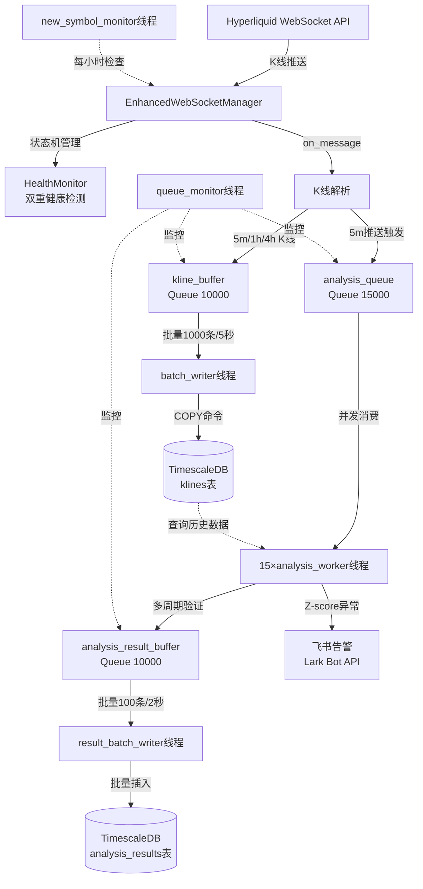
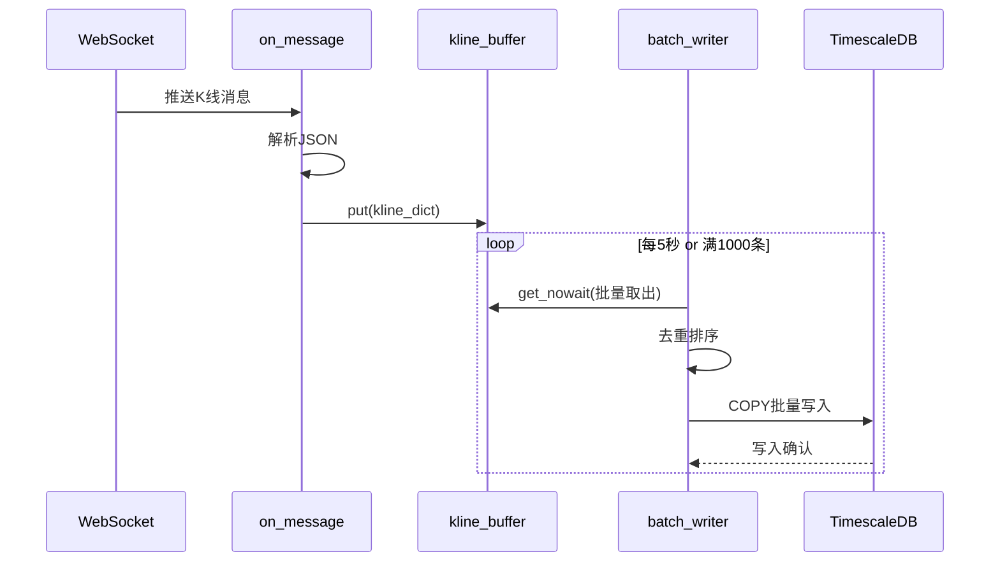
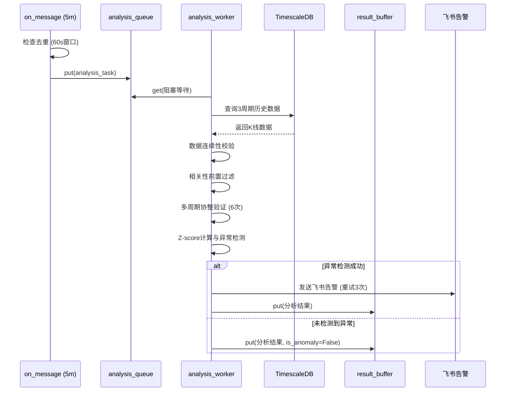

# hyperliquid-pair-hype-purr-analyze 技术设计文档

**版本**: v1.0
**生成日期**: 2026-01-31
**作者**: Claude Code
**项目**: 加密货币配对交易信号实时分析系统

---

## 目录

- [1. 项目概述](#1-项目概述)
- [2. 系统架构设计](#2-系统架构设计)
- [3. 数据库设计](#3-数据库设计)
- [4. 网络层设计](#4-网络层设计)
- [5. 分析引擎设计](#5-分析引擎设计)
- [6. 并发架构设计](#6-并发架构设计)
- [7. 性能优化设计](#7-性能优化设计)
- [8. 可靠性设计](#8-可靠性设计)
- [9. 监控与告警](#9-监控与告警)
- [10. 部署设计](#10-部署设计)
- [11. 配置管理](#11-配置管理)
- [12. 附录](#12-附录)

---

## 1. 项目概述

### 1.1 系统简介

**hyperliquid-pair-hype-purr-analyze** 是一个基于统计套利的加密货币配对交易信号实时分析系统。系统通过WebSocket实时接收Hyperliquid交易所的K线数据，执行多周期统计分析，检测配对交易机会，并通过飞书发送实时告警。

**核心定位**:
- 量化交易策略支持系统
- 实时信号发现引擎
- 统计套利机会监控平台

**代码引用**: `realtime_kline_service.py:1-35`

### 1.2 核心功能

#### 实时数据接收
- **WebSocket订阅**: 直接订阅交易所原生K线 (5m/1h/4h)
- **订阅数量**: N个活跃币种 × 3周期
- **精度保证**: 数据精度与REST API完全一致，无本地聚合误差
- **订阅优势**: 1h/4h推送频率极低 (<2%额外开销)，Volume数据完全一致

**代码引用**: `realtime_kline_service.py:5-26`

#### 多周期统计分析
- **相关性分析**: 基于收益率相关系数 (去趋势化、平稳性)
- **协整检验**: Engle-Granger两步法 (Old全量 + New双窗口)
- **Z-score异常检测**: 标准化价差监控
- **多周期验证**: 3周期 × 2方法 = 6个协整检验结果
- **协整健康监控**: 双窗口评分机制 (长期200期 + 短期100期)

**分析周期配置**:
- 5m周期: 7天历史数据
- 1h周期: 30天历史数据
- 4h周期: 60天历史数据

**代码引用**: `utils/analysis_core.py:1-44`

#### 智能告警系统
- **飞书富文本告警**: 彩色卡片格式化
- **告警触发条件**:
  - 协整通过数 ≥ 2 (可配置)
  - Z-score符号一致性
  - Z-score超阈值 (5m>1.8, 1h>1.5, 4h>0.2)
  - 协整健康状态约束 (短期窗口需HEALTHY)
- **重试机制**: 最大3次，指数退避

**代码引用**: `utils/alert_formatter.py`

#### 数据质量保证
- **K线连续性校验**: 检测时间间隙
- **自动数据补充**: REST API补充缺失K线
- **黑名单机制**: 过滤数据不足的新币种
- **协整健康监控**: 避免协整关系恶化时的虚假信号

**代码引用**: `utils/kline_data_filler.py`

### 1.3 技术栈

#### 核心技术

**编程语言**: Python 3.12+

**数据库**:
- TimescaleDB 2.x (PostgreSQL时序扩展)
- psycopg 3.x (连接池管理)
- 自动分片 (7天chunk)

**网络通信**:
- websocket-client 1.x (原生WebSocket实现)
- Hyperliquid API SDK
- requests (HTTP请求)

**统计分析**:
- NumPy 1.26+ (数值计算)
- pandas 2.2+ (数据处理)
- statsmodels 0.14+ (协整检验、ADF检验)

**并发控制**:
- threading (多线程并发)
- queue.Queue (线程安全队列)
- cachetools.TTLCache (去重缓存)

**容器化**:
- Docker 24.x
- docker-compose 2.x

**代码引用**: `pyproject.toml`, `docker-compose.yml`

### 1.4 架构亮点

#### 1. 直接订阅原生K线
- ✅ 精度与REST API一致
- ✅ 无本地聚合误差
- ✅ Volume数据完全一致
- ✅ 额外开销 <2%

**设计权衡**: 放弃本地聚合换取数据精度和简洁性

**代码引用**: `realtime_kline_service.py:22-26`

#### 2. 双窗口OLS协整分析
- **beta_window=100期**: 稳定回归参数
- **zscore_window=30期**: 敏感均值回归
- **避免look-ahead bias**: 使用前N-1期计算OLS
- **智能模型选择**: 根据α显著性选择有α/无α模型

**设计优势**: 平衡稳定性与灵敏度

**代码引用**: `utils/analysis_core.py:185-407`, `utils/config.py:BETA_WINDOW`, `utils/config.py:ZSCORE_WINDOW`

#### 3. 多线程异步批量写入
- **COPY命令**: >40K条/秒 (比INSERT快100倍)
- **临时表策略**: ON COMMIT DROP自动清理
- **批量触发**: 1000条/5秒
- **死锁防护**: 批量排序保证锁获取顺序一致

**性能提升**: 批量写入性能提升100倍

**代码引用**: `timescaledb.py:342-450`, `realtime_kline_service.py:635-760`

#### 4. 双重健康检测
**底层连接检测**:
- `ws.keep_running` 状态标志
- `ws_ready_event` 就绪标志
- `ws_thread` 存活检查

**应用层心跳** (假活检测):
- 追踪最后消息时间
- 超时阈值: 15秒
- 定期健康报告: 每60秒

**设计参考**: strong-hyperliquid-websocket

**代码引用**: `enhanced_ws_manager.py:54-114`

#### 5. 智能重连策略
- **指数退避**: 1s → 2s → 4s → 8s → 16s → 32s → 60s
- **随机抖动**: ±25% (防止雷鸣羊群效应)
- **最大重试**: 30次
- **5步确定性清理**: 停止循环 → 停止Ping → 关闭连接 → 等待线程 → 清除引用

**代码引用**: `enhanced_ws_manager.py:120-183`, `enhanced_ws_manager.py:698-781`

---

## 2. 系统架构设计

### 2.1 整体架构图



**代码引用**: `realtime_kline_service.py:118-141`

### 2.2 核心组件关系

#### 组件清单

| 组件 | 类型 | 职责 | 线程数 |
|------|------|------|--------|
| EnhancedWebSocketManager | 网络管理器 | WebSocket连接管理、订阅管理、健康监控 | 3 (主线程+Ping+健康检查) |
| batch_writer | 数据持久化 | K线批量写入TimescaleDB (COPY命令) | 1 |
| analysis_worker | 分析引擎 | 多周期协整验证、Z-score计算、告警发送 | 15 |
| result_batch_writer | 结果持久化 | 分析结果批量写入 | 1 |
| queue_monitor | 监控线程 | 队列使用率监控、告警 | 1 |
| new_symbol_monitor | 币种监控 | 自动发现新币种、动态订阅 | 1 |

**总线程数**: 22个线程 (3+1+15+1+1+1)

**代码引用**: `realtime_kline_service.py:224-275`

#### 组件交互流程

1. **数据接收流程**:
   ```
   WebSocket推送 → on_message回调 → K线解析 → kline_buffer队列
   ```

2. **批量写入流程**:
   ```
   kline_buffer → batch_writer线程 → COPY命令 → TimescaleDB
   触发条件: 1000条 OR 5秒超时
   ```

3. **分析触发流程**:
   ```
   5m K线推送 → 去重检查 (30s入队/60s分析) → analysis_queue队列
   ```

4. **并发分析流程**:
   ```
   analysis_queue → 15×analysis_worker → 查询历史数据 → 多周期验证 → 结果入队
   ```

5. **告警发送流程**:
   ```
   异常检测成功 → 飞书告警 (重试3次) → 记录发送结果
   ```

**代码引用**: `realtime_kline_service.py:635-1035`

### 2.3 数据流设计

#### K线数据流



**去重保护**:
- **入队去重**: 30秒窗口 (TTLCache)
- **数据库去重**: 主键 `(time, symbol, timeframe)` ON CONFLICT UPDATE

**代码引用**: `realtime_kline_service.py:635-760`, `timescaledb.py:342-450`

#### 分析数据流



**分析去重保护**:
- 5m周期: 60秒窗口
- 1h周期: 300秒窗口
- 4h周期: 900秒窗口
- 跨线程共享: 所有analysis_worker共享同一TTLCache

**代码引用**: `realtime_kline_service.py:908-1035`, `realtime_kline_service.py:1037-1402`

### 2.4 技术选型说明

#### 为什么选择 TimescaleDB？

**优势**:
- ✅ 基于PostgreSQL，生态成熟
- ✅ 自动分片 (chunk_time_interval=7天)
- ✅ 时序查询优化 (time-bucket聚合)
- ✅ 连续聚合视图 (Continuous Aggregates)
- ✅ 数据保留策略 (自动清理180天前数据)

**对比其他方案**:
- vs InfluxDB: PostgreSQL生态更强，SQL兼容性好
- vs ClickHouse: 部署简单，小规模场景更合适
- vs 原生PostgreSQL: 时序优化更好，分片自动管理

**代码引用**: `init_timescaledb.sql`, `docker-compose.yml`

#### 为什么选择 websocket-client？

**优势**:
- ✅ 原生Python实现，零依赖
- ✅ 简单可靠，社区活跃
- ✅ 支持自定义回调 (on_open/on_message/on_error/on_close)
- ✅ 线程模型清晰 (run_forever独立线程)

**对比其他方案**:
- vs aiohttp: 不需要asyncio复杂性
- vs python-binance: 通用性更好，不绑定特定交易所

**代码引用**: `enhanced_ws_manager.py:1-34`

#### 为什么选择多线程而非异步？

**理由**:
- ✅ psycopg 3.x同步API性能已足够 (COPY >40K条/秒)
- ✅ statsmodels同步阻塞计算，异步无优势
- ✅ 线程模型简单清晰，易于调试
- ✅ 并发分析任务完全独立，线程池模式适合

**权衡**:
- ❌ 线程上下文切换开销 (但15线程规模可接受)
- ✅ 避免asyncio生态碎片化问题

**代码引用**: `realtime_kline_service.py:224-275`

---

## 3. 数据库设计

### 3.1 TimescaleDB架构

#### 核心特性

**TimescaleDB** = PostgreSQL + 时序优化扩展

**架构优势**:
- 自动分片 (hypertable + chunks)
- 时序查询优化 (time-bucket, first/last聚合)
- 连续聚合 (Continuous Aggregates)
- 数据保留策略 (Retention Policy)
- 数据压缩 (Compression)

**代码引用**: `init_timescaledb.sql:1-11`

#### Hypertable分片策略

**klines表**:
- chunk_time_interval: 7天
- 分片键: `time`
- 索引: 自动创建时间索引

**analysis_results表**:
- chunk_time_interval: 30天
- 分片键: `analysis_time`
- 索引: 自动创建时间索引

**分片优势**:
- 查询性能: 自动分区剪枝
- 数据管理: 按chunk删除历史数据
- 并发写入: 不同chunk并发写入无锁竞争

**代码引用**: `init_timescaledb.sql:99-117`

### 3.2 核心数据表

#### klines表 (K线数据)

```sql
CREATE TABLE klines (
    time TIMESTAMPTZ NOT NULL,           -- K线时间（UTC）
    symbol VARCHAR(50) NOT NULL,         -- 币种（BTC/USDC:USDC）
    timeframe VARCHAR(10) NOT NULL,      -- 周期（5m/1h/4h）
    open DOUBLE PRECISION NOT NULL,      -- 开盘价
    high DOUBLE PRECISION NOT NULL,      -- 最高价
    low DOUBLE PRECISION NOT NULL,       -- 最低价
    close DOUBLE PRECISION NOT NULL,     -- 收盘价
    volume DOUBLE PRECISION NOT NULL,    -- 成交量
    volume_usd DOUBLE PRECISION,         -- 成交额（USD）
    return_pct DOUBLE PRECISION,         -- 收益率（%）
    created_at TIMESTAMPTZ DEFAULT NOW(),-- 写入时间

    PRIMARY KEY (time, symbol, timeframe)
);
```

**设计说明**:
- 复合主键: `(time, symbol, timeframe)` 自动去重
- `return_pct`: 预计算收益率（可选，用于加速相关性分析）
- `volume_usd`: 用于流动性过滤

**数据示例**:
```
time: 2026-01-30 12:00:00+00
symbol: BTC/USDC:USDC
timeframe: 5m
close: 106500.0
volume: 1234.56
```

**代码引用**: `init_timescaledb.sql:19-36`

#### symbol_metadata表 (币种元数据)

```sql
CREATE TABLE symbol_metadata (
    symbol VARCHAR(50) PRIMARY KEY,
    base_asset VARCHAR(20) NOT NULL,     -- 基础资产（BTC）
    quote_asset VARCHAR(20) NOT NULL,    -- 计价资产（USDC）
    listing_time TIMESTAMPTZ,            -- 上线时间
    first_kline_time TIMESTAMPTZ,        -- 首次K线时间
    last_kline_time TIMESTAMPTZ,         -- 最后K线时间
    is_active BOOLEAN DEFAULT TRUE,      -- 是否活跃
    data_quality_score DOUBLE PRECISION DEFAULT 0.0,
    total_klines BIGINT DEFAULT 0,       -- K线总数
    created_at TIMESTAMPTZ DEFAULT NOW(),
    updated_at TIMESTAMPTZ DEFAULT NOW()
);
```

**用途**:
- 追踪币种上线时间
- 过滤数据不足的新币
- 监控数据质量

**代码引用**: `init_timescaledb.sql:38-54`

#### analysis_results表 (分析结果)

```sql
CREATE TABLE analysis_results (
    id SERIAL,
    analysis_time TIMESTAMPTZ NOT NULL,  -- 分析执行时间
    symbol VARCHAR(50) NOT NULL,         -- 目标币种
    base_symbol VARCHAR(50) NOT NULL,    -- 基准币种

    -- 时间链路
    kline_time TIMESTAMPTZ,              -- K线原始时间
    analysis_delay_seconds FLOAT,        -- 分析延迟（秒）

    -- 相关系数
    corr_5m_7d DOUBLE PRECISION,         -- 5m周期7天相关系数
    corr_1h_30d DOUBLE PRECISION,        -- 1h周期30天相关系数
    corr_4h_60d DOUBLE PRECISION,        -- 4h周期60天相关系数

    -- Z-score
    zscore_5m DOUBLE PRECISION,
    zscore_1h DOUBLE PRECISION,
    zscore_4h DOUBLE PRECISION,

    -- 协整检验
    cointegration_passed BOOLEAN DEFAULT FALSE,
    adf_pvalue DOUBLE PRECISION,

    -- 信号标识
    is_anomaly BOOLEAN DEFAULT FALSE,    -- 是否异常
    trading_direction VARCHAR(50),       -- 交易方向
    signal_strength VARCHAR(20),         -- 信号强度

    created_at TIMESTAMPTZ DEFAULT NOW(),
    PRIMARY KEY (analysis_time, id)
);
```

**字段说明**:
- `kline_time`: 用于分析延迟监控
- `cointegration_passed`: 多周期协整通过标志
- `is_anomaly`: 异常检测结果（告警触发）
- `trading_direction`: long/short方向

**代码引用**: `init_timescaledb.sql:56-93`

### 3.3 索引策略

#### 主键索引 (自动创建)

```sql
-- klines表
PRIMARY KEY (time, symbol, timeframe)
→ 自动创建 B-tree 索引

-- analysis_results表
PRIMARY KEY (analysis_time, id)
→ 自动创建 B-tree 索引
```

#### 查询优化索引

```sql
-- 索引1: klines 按币种+周期+时间倒序（最常用查询）
CREATE INDEX idx_klines_symbol_timeframe_time
ON klines (symbol, timeframe, time DESC);

-- 索引2: symbol_metadata 活跃币种快速查询（部分索引）
CREATE INDEX idx_symbol_active
ON symbol_metadata (symbol)
WHERE is_active = TRUE;

-- 索引3: analysis_results 异常信号快速过滤（部分索引）
CREATE INDEX idx_analysis_anomaly_time
ON analysis_results (analysis_time DESC)
WHERE is_anomaly = TRUE;

-- 索引4: 延迟监控查询索引（部分索引）
CREATE INDEX idx_analysis_delay
ON analysis_results (analysis_delay_seconds DESC)
WHERE analysis_delay_seconds > 5;
```

**索引设计原则**:
- 覆盖最常用查询路径
- 部分索引减少索引大小
- 时间字段降序索引（最新数据优先）

**代码引用**: `init_timescaledb.sql:120-167`

### 3.4 分区策略

#### 自动分片 (Hypertable)

```sql
-- klines: 7天chunk
SELECT create_hypertable(
    'klines',
    'time',
    chunk_time_interval => INTERVAL '7 days'
);

-- analysis_results: 30天chunk
SELECT create_hypertable(
    'analysis_results',
    'analysis_time',
    chunk_time_interval => INTERVAL '30 days'
);
```

**分片效果**:
- 查询优化: 分区剪枝（仅扫描相关chunk）
- 并发写入: 不同chunk并发无锁冲突
- 历史数据管理: 按chunk删除

**代码引用**: `init_timescaledb.sql:99-117`

#### 数据保留策略

```sql
-- klines: 保留90天
SELECT add_retention_policy(
    'klines',
    INTERVAL '90 days'
);

-- analysis_results: 保留180天
SELECT add_retention_policy(
    'analysis_results',
    INTERVAL '180 days'
);
```

**自动清理**:
- 后台作业自动执行
- 按chunk删除（性能高）
- 无需手动维护

**代码引用**: `init_timescaledb.sql:169-188`

#### 数据压缩策略

```sql
-- klines: 7天后压缩（按symbol和timeframe分段）
ALTER TABLE klines SET (
    timescaledb.compress,
    timescaledb.compress_segmentby = 'symbol,timeframe'
);

SELECT add_compression_policy(
    'klines',
    INTERVAL '7 days'
);
```

**压缩效果**:
- 存储节省: 70-90%
- 查询性能: 轻微下降（可接受）
- 适用场景: 历史数据查询

**代码引用**: `init_timescaledb.sql:190-220`

### 3.5 连接池设计

#### 单例模式连接池

```python
class TimescaleDBClient:
    _instance: Optional['TimescaleDBClient'] = None
    _pool: Optional[ConnectionPool] = None

    def __new__(cls):
        if cls._instance is None:
            cls._instance = super().__new__(cls)
            cls._instance._initialized = False
        return cls._instance
```

**设计优势**:
- 全局唯一连接池实例
- 避免重复初始化
- 线程安全

**代码引用**: `timescaledb.py:94-129`

#### 连接池配置

```python
self._pool = ConnectionPool(
    conninfo=self.config.connection_string,
    min_size=2,    # 最小连接数
    max_size=10,   # 最大连接数
    timeout=30,    # 获取连接超时（秒）
    max_lifetime=3600,  # 连接最大存活时间（秒）
    max_idle=600,       # 最大空闲时间（秒）
    open=True
)
```

**参数说明**:
- `min_size=2`: 保持最少2个活跃连接
- `max_size=10`: 最多10个并发连接
- `max_lifetime=3600`: 每小时回收连接（防止连接泄漏）
- `max_idle=600`: 10分钟空闲自动回收

**代码引用**: `timescaledb.py:131-150`

#### 连接污染检测

```python
@contextmanager
def get_connection(self) -> Connection:
    conn = None
    connection_valid = True

    try:
        conn = self._pool.getconn()
        yield conn
        conn.commit()
    except Exception as e:
        if conn:
            try:
                conn.rollback()
                # 关键: 测试连接是否仍然可用
                with conn.cursor() as test_cur:
                    test_cur.execute("SELECT 1")
            except Exception as test_e:
                # 连接已污染，标记为无效
                logger.error(f"连接已污染，将其移除: {test_e}")
                connection_valid = False
        raise
    finally:
        if conn:
            if connection_valid:
                self._pool.putconn(conn)  # 健康连接复用
            else:
                self._pool.putconn(conn, close=True)  # 污染连接移除
```

**污染检测机制**:
1. 异常后执行 `SELECT 1` 测试
2. 测试失败 → 标记为污染连接
3. 污染连接关闭并移除
4. 健康连接返回连接池复用

**代码引用**: `timescaledb.py:152-217`

---

## 4. 网络层设计

### 4.1 WebSocket管理器架构

#### 核心类设计

```python
class EnhancedWebSocketManager:
    """
    增强型 WebSocket 连接管理器

    核心功能:
    - 双重健康检测（底层连接 + 应用层心跳）
    - 指数退避重连策略
    - 完整的状态机管理
    - 线程安全设计
    - 可观测性（统计信息和健康报告）
    """
```

**设计参考**: strong-hyperliquid-websocket

**代码引用**: `enhanced_ws_manager.py:1-34`

#### 状态机管理

```python
class ConnectionState(Enum):
    DISCONNECTED = "disconnected"  # 未连接
    CONNECTING = "connecting"      # 连接中
    CONNECTED = "connected"        # 已连接
    RECONNECTING = "reconnecting"  # 重连中
    FAILED = "failed"              # 连接失败
```

**状态转换**:
```
DISCONNECTED → CONNECTING → CONNECTED
     ↓              ↓            ↓
  FAILED ← RECONNECTING ← (网络中断)
```

**代码引用**: `enhanced_ws_manager.py:41-48`

#### 线程模型

**主要线程**:
1. **WebSocket主线程**: 运行 `WebSocket.run_forever()`
2. **Ping线程**: 每5秒发送ping保活
3. **健康监控线程**: 每2秒检查连接健康

**线程同步**:
- `ws_thread`: WebSocket主线程句柄
- `ws_ready_event`: WebSocket就绪标志（threading.Event）
- `stop_ping`: Ping线程停止信号（threading.Event）

**代码引用**: `enhanced_ws_manager.py:501-597`

### 4.2 双重健康检测机制

#### 底层连接检测

```python
def _is_connected_base(self) -> bool:
    """检查底层WebSocket连接状态"""
    with self.state_lock:
        return (
            self.ws is not None
            and self.ws.keep_running  # WebSocket底层标志
            and self.ws_ready_event.is_set()  # 就绪标志
            and self.ws_thread is not None
            and self.ws_thread.is_alive()  # 线程存活
        )
```

**检测指标**:
- `ws.keep_running`: WebSocket底层运行标志
- `ws_ready_event`: 连接就绪标志
- `ws_thread.is_alive()`: 线程存活检查

**代码引用**: `enhanced_ws_manager.py:800-828`

#### 应用层心跳 (假活检测)

```python
class HealthMonitor:
    """
    健康监控器（应用层心跳）

    功能:
    - 追踪最后消息接收时间
    - 检测数据流中断（假活状态）
    - 双阈值告警（警告 + 超时）
    """

    def __init__(self, timeout=15, warning_threshold=10):
        self.timeout = timeout  # 15秒超时
        self.warning_threshold = warning_threshold  # 10秒警告
        self.last_message_time = time.time()
        self.message_count = 0

    def is_alive(self) -> tuple[bool, float]:
        idle_time = time.time() - self.last_message_time

        if idle_time > self.timeout:
            return False, idle_time  # 假活检测
        elif idle_time > self.warning_threshold:
            logger.warning(f"健康检查警告: {idle_time:.1f}秒未收到数据")

        return True, idle_time
```

**假活场景**:
- WebSocket底层连接正常
- 但15秒未收到任何消息 → 判定为假活
- 触发重连

**健康度百分比**:
```python
def get_health_percentage(self) -> float:
    _, idle_time = self.is_alive()
    return max(0, 100 - (idle_time / self.timeout * 100))
```

**代码引用**: `enhanced_ws_manager.py:54-114`

### 4.3 重连策略设计

#### 指数退避算法

```python
class ReconnectionManager:
    """
    重连管理器（指数退避策略）

    特性:
    - 指数退避: 1s → 2s → 4s → 8s → 16s → 32s → 60s
    - 随机抖动: ±25% (防止雷鸣羊群效应)
    - 可配置最大延迟和重试次数
    """

    def __init__(
        self,
        initial_delay=1.0,    # 初始延迟
        max_delay=60.0,       # 最大延迟
        multiplier=2.0,       # 递增因子
        max_retries=None      # 最大重试次数
    ):
        self.initial_delay = initial_delay
        self.max_delay = max_delay
        self.multiplier = multiplier
        self.max_retries = max_retries
        self.current_attempt = 0
```

**延迟计算**:
```python
def get_delay(self) -> float:
    # 指数退避: initial_delay * multiplier^attempt
    delay = self.initial_delay * (self.multiplier ** self.current_attempt)
    delay = min(delay, self.max_delay)

    # 随机抖动: ±25%
    jitter = delay * (random.random() - 0.5) * 0.5  # ±25%
    return max(0, delay + jitter)
```

**退避序列示例**:
```
尝试1: 1.0s ± 25% = 0.75-1.25s
尝试2: 2.0s ± 25% = 1.5-2.5s
尝试3: 4.0s ± 25% = 3.0-5.0s
尝试4: 8.0s ± 25% = 6.0-10.0s
尝试5: 16.0s ± 25% = 12.0-20.0s
尝试6: 32.0s ± 25% = 24.0-40.0s
尝试7+: 60.0s ± 25% = 45.0-75.0s (封顶)
```

**代码引用**: `enhanced_ws_manager.py:120-183`

#### 5步确定性清理

```python
def _force_cleanup_websocket(self):
    """
    5步确定性清理 WebSocket 连接

    步骤:
    1. 停止运行循环
    2. 停止Ping线程
    3. 关闭WebSocket连接
    4. 等待WebSocket线程退出
    5. 清除引用
    """

    # Step 1: 停止运行循环
    if self.ws:
        self.ws.keep_running = False

    # Step 2: 停止Ping线程
    if hasattr(self, 'stop_ping'):
        self.stop_ping.set()
        if hasattr(self, 'ping_thread'):
            self.ping_thread.join(timeout=2.0)

    # Step 3: 关闭WebSocket连接
    if self.ws:
        try:
            self.ws.close()
        except Exception as e:
            logger.warning(f"关闭WebSocket时出错: {e}")

    # Step 4: 等待WebSocket线程退出
    if self.ws_thread and self.ws_thread.is_alive():
        self.ws_thread.join(timeout=2.0)
        if self.ws_thread.is_alive():
            logger.warning("WebSocket线程未正常退出")

    # Step 5: 清除引用
    self.ws = None
    self.ws_thread = None
    self.ws_ready_event.clear()
```

**清理保证**:
- 确定性顺序执行
- 超时保护（2秒）
- 线程泄漏检测

**代码引用**: `enhanced_ws_manager.py:698-781`

### 4.4 订阅管理与数据缓存

#### 动态订阅管理

```python
def add_subscriptions(self, new_subscriptions: List[Dict]):
    """动态添加订阅"""
    with self.subscriptions_lock:
        for sub in new_subscriptions:
            sub_key = (sub['type'], tuple(sorted(sub.items())))
            if sub_key not in self.active_subscriptions:
                self.subscriptions.append(sub)
                self.active_subscriptions.add(sub_key)

        # 如果连接已建立，立即发送订阅
        if self._is_connected():
            self._send_subscriptions(new_subscriptions)
```

**订阅去重**:
- `active_subscriptions`: set集合
- 订阅键: `(type, sorted_params)` 元组

**即时订阅 vs 延迟订阅**:
- 连接已建立 → 立即发送subscribe消息
- 连接未建立 → 添加到列表，重连时自动订阅

**代码引用**: `enhanced_ws_manager.py:420-470`

#### 数据缓存设计

```python
# latest_data 字典缓存最新K线/订单簿/交易记录
self.latest_data = {
    "candles": {},      # {(symbol, timeframe): kline_dict}
    "l2Book": {},       # {symbol: orderbook_dict}
    "trades": {},       # {symbol: [trade_list]}
}

# 同步查询接口
def get_latest_candle(self, symbol: str, timeframe: str) -> Optional[Dict]:
    """获取最新K线（同步查询）"""
    with self.latest_data_lock:
        return self.latest_data["candles"].get((symbol, timeframe))

def get_latest_mid_price(self, symbol: str) -> Optional[float]:
    """获取最新中间价（同步查询）"""
    with self.latest_data_lock:
        book = self.latest_data["l2Book"].get(symbol)
        if book and 'levels' in book:
            levels = book['levels']
            if len(levels) >= 2:
                best_bid = float(levels[0][0]['px'])
                best_ask = float(levels[1][0]['px'])
                return (best_bid + best_ask) / 2
    return None
```

**应用场景**:
- 同步查询最新价格
- 避免重复数据库查询
- 降低API请求频率

**代码引用**: `enhanced_ws_manager.py:194-343`

---

