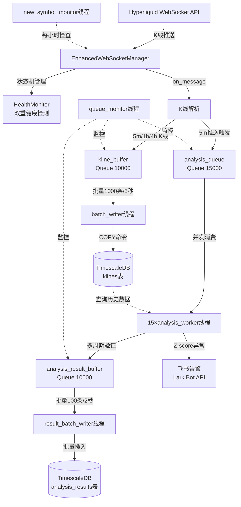
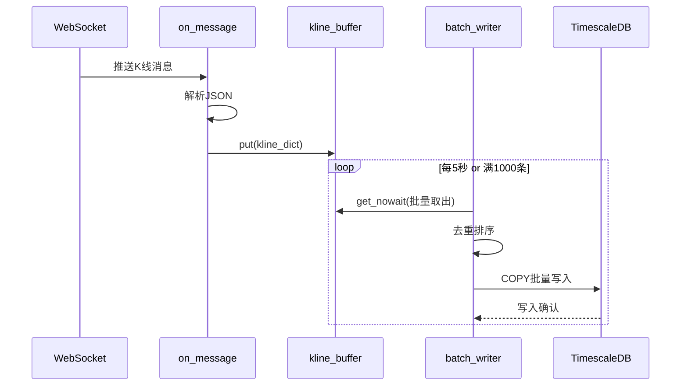
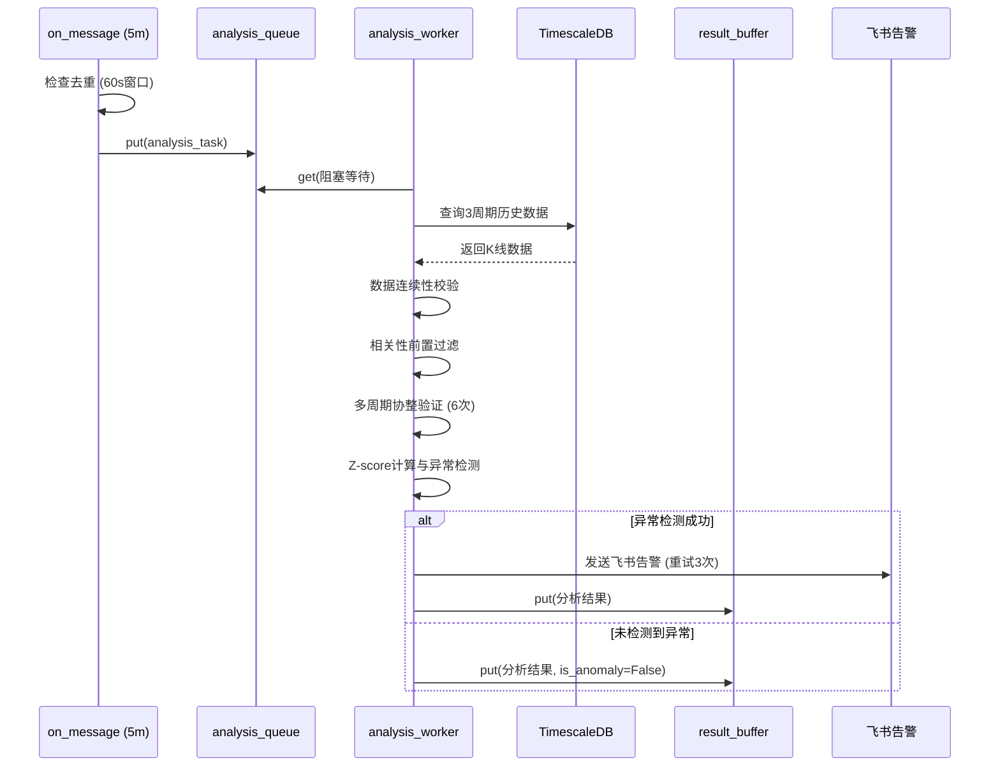

# hyperliquid-pair-hype-purr-analyze 技术设计文档

**版本**: v1.0
**生成日期**: 2026-01-31
**作者**: Claude Code
**项目**: 加密货币配对交易信号实时分析系统

---

## 目录

- [1. 项目概述](#1-项目概述)
- [2. 系统架构设计](#2-系统架构设计)
- [3. 数据库设计](#3-数据库设计)
- [4. 网络层设计](#4-网络层设计)
- [5. 分析引擎设计](#5-分析引擎设计)
- [6. 并发架构设计](#6-并发架构设计)
- [7. 性能优化设计](#7-性能优化设计)
- [8. 可靠性设计](#8-可靠性设计)
- [9. 监控与告警](#9-监控与告警)
- [10. 部署设计](#10-部署设计)
- [11. 配置管理](#11-配置管理)
- [12. 附录](#12-附录)

---

## 1. 项目概述

### 1.1 系统简介

**hyperliquid-pair-hype-purr-analyze** 是一个基于统计套利的加密货币配对交易信号实时分析系统。系统通过WebSocket实时接收Hyperliquid交易所的K线数据，执行多周期统计分析，检测配对交易机会，并通过飞书发送实时告警。

**核心定位**:
- 量化交易策略支持系统
- 实时信号发现引擎
- 统计套利机会监控平台

**代码引用**: `realtime_kline_service.py:1-35`

### 1.2 核心功能

#### 实时数据接收
- **WebSocket订阅**: 直接订阅交易所原生K线 (5m/1h/4h)
- **订阅数量**: N个活跃币种 × 3周期
- **精度保证**: 数据精度与REST API完全一致，无本地聚合误差
- **订阅优势**: 1h/4h推送频率极低 (<2%额外开销)，Volume数据完全一致

**代码引用**: `realtime_kline_service.py:5-26`

#### 多周期统计分析
- **相关性分析**: 基于收益率相关系数 (去趋势化、平稳性)
- **协整检验**: Engle-Granger两步法 (Old全量 + New双窗口)
- **Z-score异常检测**: 标准化价差监控
- **多周期验证**: 3周期 × 2方法 = 6个协整检验结果
- **协整健康监控**: 双窗口评分机制 (长期200期 + 短期100期)

**分析周期配置**:
- 5m周期: 7天历史数据
- 1h周期: 30天历史数据
- 4h周期: 60天历史数据

**代码引用**: `utils/analysis_core.py:1-44`

#### 智能告警系统
- **飞书富文本告警**: 彩色卡片格式化
- **告警触发条件**:
  - 协整通过数 ≥ 2 (可配置)
  - Z-score符号一致性
  - Z-score超阈值 (5m>1.8, 1h>1.5, 4h>0.2)
  - 协整健康状态约束 (短期窗口需HEALTHY)
- **重试机制**: 最大3次，指数退避

**代码引用**: `utils/alert_formatter.py`

#### 数据质量保证
- **K线连续性校验**: 检测时间间隙
- **自动数据补充**: REST API补充缺失K线
- **黑名单机制**: 过滤数据不足的新币种
- **协整健康监控**: 避免协整关系恶化时的虚假信号

**代码引用**: `utils/kline_data_filler.py`

### 1.3 技术栈

#### 核心技术

**编程语言**: Python 3.12+

**数据库**:
- TimescaleDB 2.x (PostgreSQL时序扩展)
- psycopg 3.x (连接池管理)
- 自动分片 (7天chunk)

**网络通信**:
- websocket-client 1.x (原生WebSocket实现)
- Hyperliquid API SDK
- requests (HTTP请求)

**统计分析**:
- NumPy 1.26+ (数值计算)
- pandas 2.2+ (数据处理)
- statsmodels 0.14+ (协整检验、ADF检验)

**并发控制**:
- threading (多线程并发)
- queue.Queue (线程安全队列)
- cachetools.TTLCache (去重缓存)

**容器化**:
- Docker 24.x
- docker-compose 2.x

**代码引用**: `pyproject.toml`, `docker-compose.yml`

### 1.4 架构亮点

#### 1. 直接订阅原生K线
- ✅ 精度与REST API一致
- ✅ 无本地聚合误差
- ✅ Volume数据完全一致
- ✅ 额外开销 <2%

**设计权衡**: 放弃本地聚合换取数据精度和简洁性

**代码引用**: `realtime_kline_service.py:22-26`

#### 2. 双窗口OLS协整分析
- **beta_window=100期**: 稳定回归参数
- **zscore_window=30期**: 敏感均值回归
- **避免look-ahead bias**: 使用前N-1期计算OLS
- **智能模型选择**: 根据α显著性选择有α/无α模型

**设计优势**: 平衡稳定性与灵敏度

**代码引用**: `utils/analysis_core.py:185-407`, `utils/config.py:BETA_WINDOW`, `utils/config.py:ZSCORE_WINDOW`

#### 3. 多线程异步批量写入
- **COPY命令**: >40K条/秒 (比INSERT快100倍)
- **临时表策略**: ON COMMIT DROP自动清理
- **批量触发**: 1000条/5秒
- **死锁防护**: 批量排序保证锁获取顺序一致

**性能提升**: 批量写入性能提升100倍

**代码引用**: `timescaledb.py:342-450`, `realtime_kline_service.py:635-760`

#### 4. 双重健康检测
**底层连接检测**:
- `ws.keep_running` 状态标志
- `ws_ready_event` 就绪标志
- `ws_thread` 存活检查

**应用层心跳** (假活检测):
- 追踪最后消息时间
- 超时阈值: 15秒
- 定期健康报告: 每60秒

**设计参考**: strong-hyperliquid-websocket

**代码引用**: `enhanced_ws_manager.py:54-114`

#### 5. 智能重连策略
- **指数退避**: 1s → 2s → 4s → 8s → 16s → 32s → 60s
- **随机抖动**: ±25% (防止雷鸣羊群效应)
- **最大重试**: 30次
- **5步确定性清理**: 停止循环 → 停止Ping → 关闭连接 → 等待线程 → 清除引用

**代码引用**: `enhanced_ws_manager.py:120-183`, `enhanced_ws_manager.py:698-781`

---

## 2. 系统架构设计

### 2.1 整体架构图



**代码引用**: `realtime_kline_service.py:118-141`

### 2.2 核心组件关系

#### 组件清单

| 组件 | 类型 | 职责 | 线程数 |
|------|------|------|--------|
| EnhancedWebSocketManager | 网络管理器 | WebSocket连接管理、订阅管理、健康监控 | 3 (主线程+Ping+健康检查) |
| batch_writer | 数据持久化 | K线批量写入TimescaleDB (COPY命令) | 1 |
| analysis_worker | 分析引擎 | 多周期协整验证、Z-score计算、告警发送 | 15 |
| result_batch_writer | 结果持久化 | 分析结果批量写入 | 1 |
| queue_monitor | 监控线程 | 队列使用率监控、告警 | 1 |
| new_symbol_monitor | 币种监控 | 自动发现新币种、动态订阅 | 1 |

**总线程数**: 22个线程 (3+1+15+1+1+1)

**代码引用**: `realtime_kline_service.py:224-275`

#### 组件交互流程

1. **数据接收流程**:
   ```
   WebSocket推送 → on_message回调 → K线解析 → kline_buffer队列
   ```

2. **批量写入流程**:
   ```
   kline_buffer → batch_writer线程 → COPY命令 → TimescaleDB
   触发条件: 1000条 OR 5秒超时
   ```

3. **分析触发流程**:
   ```
   5m K线推送 → 去重检查 (30s入队/60s分析) → analysis_queue队列
   ```

4. **并发分析流程**:
   ```
   analysis_queue → 15×analysis_worker → 查询历史数据 → 多周期验证 → 结果入队
   ```

5. **告警发送流程**:
   ```
   异常检测成功 → 飞书告警 (重试3次) → 记录发送结果
   ```

**代码引用**: `realtime_kline_service.py:635-1035`

### 2.3 数据流设计

#### K线数据流



**去重保护**:
- **入队去重**: 30秒窗口 (TTLCache)
- **数据库去重**: 主键 `(time, symbol, timeframe)` ON CONFLICT UPDATE

**代码引用**: `realtime_kline_service.py:635-760`, `timescaledb.py:342-450`

#### 分析数据流



**分析去重保护**:
- 5m周期: 60秒窗口
- 1h周期: 300秒窗口
- 4h周期: 900秒窗口
- 跨线程共享: 所有analysis_worker共享同一TTLCache

**代码引用**: `realtime_kline_service.py:908-1035`, `realtime_kline_service.py:1037-1402`

### 2.4 技术选型说明

#### 为什么选择 TimescaleDB？

**优势**:
- ✅ 基于PostgreSQL，生态成熟
- ✅ 自动分片 (chunk_time_interval=7天)
- ✅ 时序查询优化 (time-bucket聚合)
- ✅ 连续聚合视图 (Continuous Aggregates)
- ✅ 数据保留策略 (自动清理180天前数据)

**对比其他方案**:
- vs InfluxDB: PostgreSQL生态更强，SQL兼容性好
- vs ClickHouse: 部署简单，小规模场景更合适
- vs 原生PostgreSQL: 时序优化更好，分片自动管理

**代码引用**: `init_timescaledb.sql`, `docker-compose.yml`

#### 为什么选择 websocket-client？

**优势**:
- ✅ 原生Python实现，零依赖
- ✅ 简单可靠，社区活跃
- ✅ 支持自定义回调 (on_open/on_message/on_error/on_close)
- ✅ 线程模型清晰 (run_forever独立线程)

**对比其他方案**:
- vs aiohttp: 不需要asyncio复杂性
- vs python-binance: 通用性更好，不绑定特定交易所

**代码引用**: `enhanced_ws_manager.py:1-34`

#### 为什么选择多线程而非异步？

**理由**:
- ✅ psycopg 3.x同步API性能已足够 (COPY >40K条/秒)
- ✅ statsmodels同步阻塞计算，异步无优势
- ✅ 线程模型简单清晰，易于调试
- ✅ 并发分析任务完全独立，线程池模式适合

**权衡**:
- ❌ 线程上下文切换开销 (但15线程规模可接受)
- ✅ 避免asyncio生态碎片化问题

**代码引用**: `realtime_kline_service.py:224-275`

---

